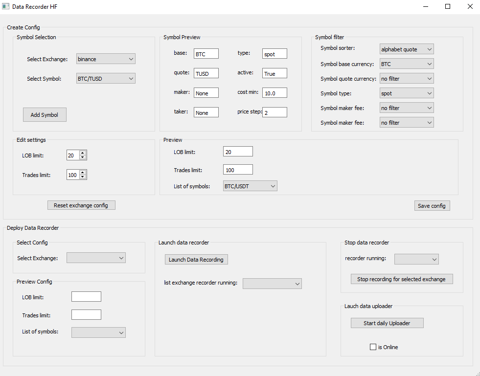
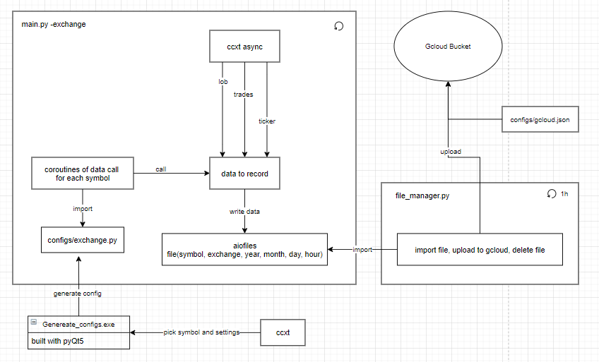

# hf_crypto_data_recorder

This app is made to launch async subprocess of high frequency crypto data recording for trades/lob/ticker. \
There is a config editor incuded to selected symbol & settings for the recording of an exchange. \
Data are stored in a txt file with aiofiles, and called with ccxt. \ 
Each hour there is a parallel process that take the txt file and upload it to Google cloud storage, to save hard disk space.

GUI interface

Functioning of the async sub processes

# Requierment

 * ccxt
 * pyQt5
 * pynstaller
 * asyncio
 * aiofiles
 * google-cloud-storage
 * numpy / pandas

# deploy

- [ ] edit the config file
- [ ] in terminal run `pyinstaller.exe --onefile --windowed --icon=icon.ico main.py`

  
  
# Todo List

- [ ] add subprocess creation within main app (compile an all in one app)
- [ ] Create the uploader py
- [ ] parse frequency of uploader in config file
  
# References

* pyQt5 doc: https://doc.qt.io/qtforpython-5/PySide2/QtWidgets/index.html#module-PySide2.QtWidgets

* pyinstaller: https://www.pyinstaller.org/

* ccxt doc: https://github.com/ccxt/ccxt/wiki/Manual#unified-api

* google storage doc: https://cloud.google.com/storage/docs?hl=fr

* google cloud auth: https://cloud.google.com/storage/docs/reference/libraries?authuser=2
